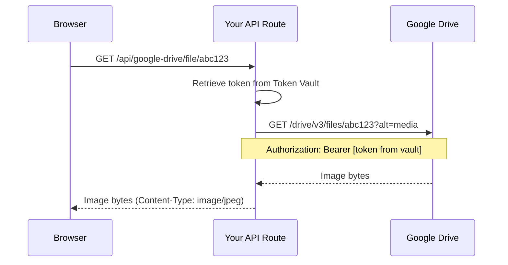

# Module 04: Connecting Google Drive

Now that Token Vault is configured on the Auth0 side, it's time to write the code that actually *uses* it. In this module, you'll implement token retrieval in three places — two API routes and the settings page.

---

## 💡 Learning Objectives

- Use `auth0.getAccessTokenForConnection()` to retrieve stored tokens
- Understand the Google Drive API proxy pattern
- Implement a connection status check using try/catch
- See how Token Vault tokens flow through your backend

---

## ℹ️ Overview

We're making three code changes in this module:

| Change | File | What It Does |
|--------|------|-------------|
| **3** | `app/api/google-drive/route.ts` | Retrieve token for listing images in a folder |
| **4** | `app/api/google-drive/file/[id]/route.ts` | Retrieve token for downloading individual images |
| **5** | `app/settings/page.tsx` | Check if user has connected Google |

All three use the same Auth0 SDK method: `auth0.getAccessTokenForConnection()`. This method reaches into Token Vault, retrieves the stored Google OAuth token for the current user, and returns it for use in API calls.

---

## 🧑‍💻 Change 3: Token Retrieval for Folder Listing

Open `app/app/api/google-drive/route.ts`. This API route handles listing images from a Google Drive folder. Find the TODO:

```typescript
export async function GET(request: NextRequest) {
  try {
    // TODO (Module 04, Change 3): Retrieve the Google OAuth token using Token Vault
    // Use auth0.getAccessTokenForConnection() with connection: 'google-oauth2'
    const token = ''
```

Right now, `token` is an empty string — so any Google Drive API calls will fail with a 401 Unauthorized.

**Your task:** Replace the TODO comment and empty string with a call to `auth0.getAccessTokenForConnection()`.

> *Hint:* The method is `async` and returns an object with a `token` property. You can destructure it: `const { token } = await auth0.getAccessTokenForConnection({ connection: 'google-oauth2' })`

<details>
<br>
<summary>✅ Solution</summary>

```typescript
export async function GET(request: NextRequest) {
  try {
    const { token } = await auth0.getAccessTokenForConnection({
      connection: 'google-oauth2'
    })
```

Replace the TODO comment and `const token = ''` with the code above.

**How this works:**
1. The method calls Auth0's Token Vault for the currently authenticated user
2. Token Vault returns the stored Google OAuth access token
3. If the token has expired, Auth0 automatically uses the refresh token to get a new one
4. The `token` variable now contains a valid Google access token

</details>

### ℹ️ Understanding the Route

After the token is retrieved, the route uses it to make two Google Drive API calls:

1. **Find the folder** — searches for a folder with the given name
2. **List images** — finds all image files inside that folder

Both calls include the token in the `Authorization: Bearer` header:

```typescript
const folderRes = await fetch(
  `https://www.googleapis.com/drive/v3/files?${folderParams}`,
  { headers: { Authorization: `Bearer ${token}` } }
)
```

The browser never sees this token. It only exists in your server-side API route.

---

## 🧑‍💻 Change 4: Token Retrieval for File Proxy

Open `app/app/api/google-drive/file/[id]/route.ts`. This route proxies individual image files from Google Drive. Find the TODO:

```typescript
  try {
    const { id } = await params

    // TODO (Module 04, Change 4): Retrieve the Google OAuth token using Token Vault
    // Use auth0.getAccessTokenForConnection() with connection: 'google-oauth2'
    const token = ''
```

**Your task:** Same as Change 3 — replace the empty string with token retrieval.

<details>
<br>
<summary>✅ Solution</summary>

```typescript
  try {
    const { id } = await params

    const { token } = await auth0.getAccessTokenForConnection({
      connection: 'google-oauth2'
    })
```

</details>

### ℹ️ The Proxy Pattern

This route is worth understanding. Here's what happens when the game displays an image:



**Why proxy instead of using direct Google Drive URLs?**

- The browser never needs the Google token
- Your app controls caching headers
- You can add logging, rate limiting, or access control
- If Google changes their API, only your backend needs updating

---

## 🧑‍💻 Change 5: Check Google Connection Status

Open `app/app/settings/page.tsx`. This server component checks whether the user has already connected their Google account:

```typescript
async function isGoogleConnected() {
  // TODO (Module 04, Change 5): Check if the user has connected their Google account via Token Vault
  // Use auth0.getAccessTokenForConnection() to verify the connection exists
  return false
}
```

Right now it always returns `false`, so the settings page always shows the "Connect Google Drive" button — even if the user has already connected.

**Your task:** Use `auth0.getAccessTokenForConnection()` inside a try/catch. If the call succeeds, the user is connected. If it throws an error, they haven't connected yet.

> *Hint:* You don't need the token value itself — you just need to know if the call succeeds or fails.

<details>
<br>
<summary>✅ Solution</summary>

```typescript
async function isGoogleConnected() {
  try {
    await auth0.getAccessTokenForConnection({ connection: 'google-oauth2' })
    return true
  } catch {
    return false
  }
}
```

**How this works:**
- If the user has connected Google → Token Vault has their token → call succeeds → return `true`
- If the user hasn't connected → Token Vault has no token → call throws → catch returns `false`

> **Note**
> The error in the `catch` block is **expected behavior**, not a bug. It simply means the user hasn't connected their Google account yet.

</details>

---

## ✅ Verification

Save all three files and restart the dev server:

```bash
# Press Ctrl+C to stop, then:
pnpm dev:app
```

Go to `http://localhost:3000/settings`. You should see:

- The "Connect Google Drive" button is still a **placeholder** (we haven't added the real button in the UI yet — that's the next module!)
- No errors in the terminal/console
- The app still works normally

> **Note**
> You won't be able to test the full flow yet because the Connect button in the UI is still a placeholder. That's what we'll fix in the next module.

---

## ✅ Checkpoint

- [ ] Change 3: Token retrieval added to `/api/google-drive` route
- [ ] Change 4: Token retrieval added to `/api/google-drive/file/[id]` route
- [ ] Change 5: Connection status check implemented in settings page
- [ ] App starts without errors
- [ ] No tokens are exposed to the browser (all retrieval is server-side)

---

| Back | Next |
|------|------|
| [&larr; Configuring Token Vault](03-Configuring-Token-Vault.md) | [Enabling the Connect Flow &rarr;](05-Enabling-the-Connect-Flow.md) |
